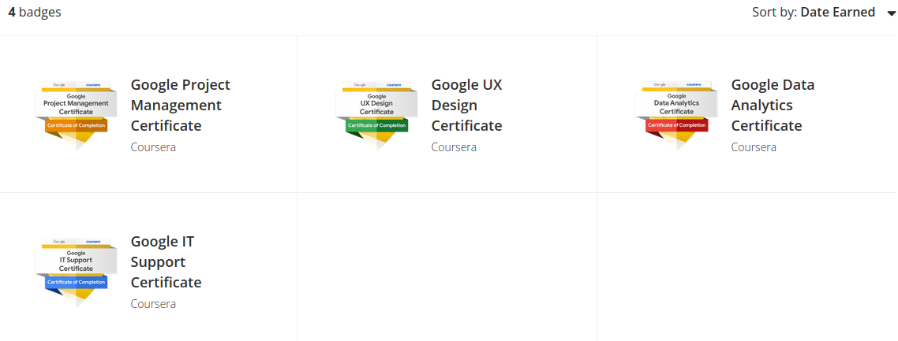
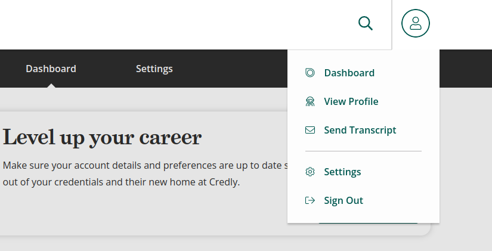
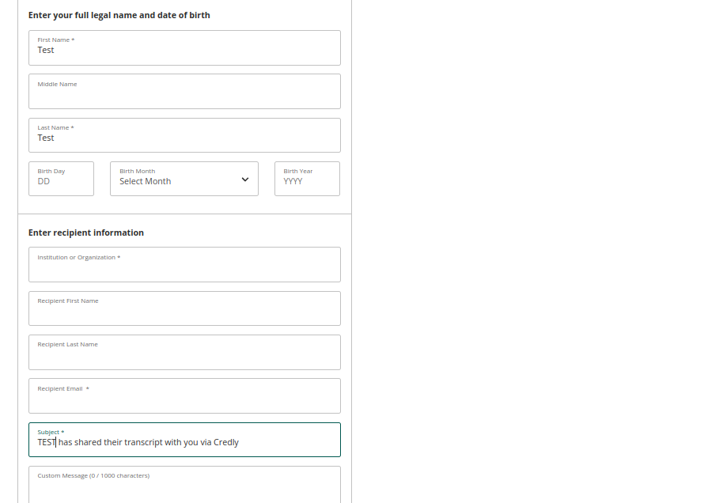
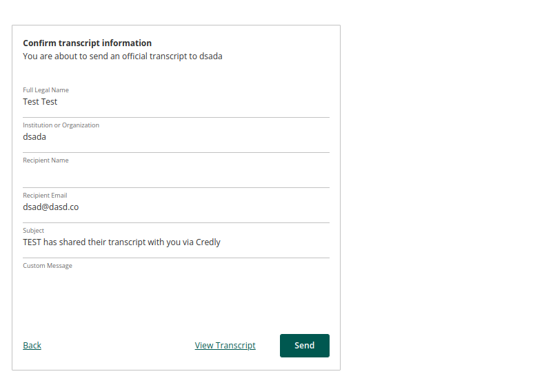
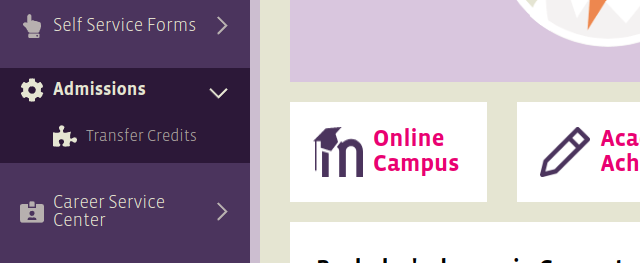

# دليل نقل الساعات الاكاديمية من منصة كورسيرا

---

مثلما يعلم الكثير من الطلاب ان جامعتنا تقبل نقل الساعات الاكاديمية التي تكون معتمدة من مؤسسة ACE, ولحسن حظنا فانه في الفترة الاخيرة حصلت الكثير من المساقات الموجودة على منصة كورسيرا على اعتماد مؤسسة ACE.

حتى تاريخ كتابة هذا المقال, هذه هي المساقات التي تعطينا ساعات اكاديمية قابلة للنقل: [المصدر](https://www.coursera.support/s/article/learner-000001647-ACE-credit-recommendation-FAQs).

| **Course**                                                   | **Effective Dates**     | **Recommended Credits** | المواد التي تعادلها حسب تجارب الطلاب                         |
| ------------------------------------------------------------ | ----------------------- | ----------------------- | ------------------------------------------------------------ |
| [Deep Learning Specialization](https://www.coursera.org/specializations/deep-learning?) | 04/01/2022 - 03/31/2025 | 10                      |                                                              |
| [Facebook Social Media Marketing Professional Exam](https://www.coursera.org/professional-certificates/facebook-social-media-marketing)<br />[Facebook Social Media Marketing Professional Certificate](https://www.coursera.org/professional-certificates/facebook-social-media-marketing) | 11/1/2021 - 10/31/2024  | 1 + 2                   | - Elective                                                   |
| [Google Project Management Professional Certificate](https://www.coursera.org/professional-certificates/google-project-management?) | 08/01/21 - 07/31/24     | 9                       | - General Education (Disciplinary area)<br />- Elective<br />- Elective |
| [Google UX Design Professional Certificate](https://www.coursera.org/professional-certificates/google-ux-design) | 08/01/21 - 07/31/24     | 10                      | - Web Programming 1 (CS 2205)<br />- ~~Elective~~ Web Programing 2 (CS 3305)<br />- Elecitve |
| [Google Data Analytics Professional Certificate](https://www.coursera.org/professional-certificates/google-data-analytics) | 08/01/21 - 07/31/24     | 12                      | - Database 1 (CS 2203)<br />- Database 2 (CS 3306)<br />- Elective<br />- Elective |
| [Google IT Support Professional Certificate](https://www.coursera.org/professional-certificates/google-it-support) | 09/01/19 - 08/30/22     | 12                      | - General Education (Natural Sciences & Technology)<br />- Communications and Networking (CS 2204)<br />- ~~Elective~~ Computer Systems (CS 1104)<br />- ~~Elective~~ Operating Systems 1 (CS2301) |
| [IBM Cybersecurity Analyst Professional Certificate](https://www.coursera.org/professional-certificates/ibm-cybersecurity-analyst) | 10/01/2021 - 09/30/2024 | 10                      |                                                              |
| [IBM Data Science Professional Certificate](https://www.coursera.org/professional-certificates/ibm-data-science) | 10/01/2021 - 09/30/2024 | 12                      | - Database 1 (CS 2203)<br />- Database 2 (CS 3306)<br />- Programming Fundamentals (CS 1101) or Programming 1 (CS 1102)<br />- Elective |
| [IBM Data Analyst Professional Certificate](https://www.coursera.org/professional-certificates/ibm-data-analyst) | 10/01/2021 - 09/30/2024 | 12                      | - Database 1 (CS 2203)<br />- Database 2 (CS 3306)<br />- Programming Fundamentals (CS 1101) or Programming 1 (CS 1102)<br />- Elective |
| [IBM Introduction to Data Science Specialization](https://www.coursera.org/specializations/introduction-data-science) | 05/30/2022 - 06/03/2025 | 7                       |                                                              |
| [IBM Data Analysis and Visualization Foundations Specialization](https://www.coursera.org/specializations/data-analysis-visualization-foundations) | 02/1/2022 - 01/31/2025  | 9                       |                                                              |
| [IBM Applied Data Science Specialization](https://www.coursera.org/specializations/applied-data-science) | 02/1/2022 - 01/31/2025  | 12                      |                                                              |
| [IBM Data Analytics with Excel and R Professional Certificate](https://www.coursera.org/professional-certificates/ibm-data-analyst-r-excel) | 05/01/2022 - 04/30/2025 | 15                      |                                                              |
| [IBM Data Engineering Professional Certificate](https://www.coursera.org/professional-certificates/ibm-data-engineer) | 05/01/2022 - 04/30/2025 | 12                      |                                                              |
| [IBM Data Science Fundamentals with Python & SQL Specialization](https://www.coursera.org/specializations/data-science-fundamentals-python-sql) | 05/01/2022 - 04/30/2025 | 8                       |                                                              |
| [IBM Full Stack Cloud Developer Professional Certificate](https://www.coursera.org/professional-certificates/ibm-full-stack-cloud-developer) | 05/01/2022 - 04/30/2025 | 18                      |                                                              |
| [Real-World Cloud Product Management Specialization](https://www.coursera.org/specializations/real-world-cloud-pm) | 05/01/2022 - 04/30/2025 | 6                       |                                                              |
| [Real-World Product Management Specialization](https://www.coursera.org/specializations/real-world-product-management) | 05/01/2022 - 04/30/2025 | 6                       |                                                              |
| [Salesforce Sales Operations Professional Certificate](https://www.coursera.org/professional-certificates/salesforce-sales-operations) | 06/01/2022 - 05/31/2025 | 1                       |                                                              |
| [SAS Programmer Professional Certificate](https://www.coursera.org/professional-certificates/sas-programming) | 05/01/2022 - 04/30/2025 | 4                       |                                                              |
| [SAS Advanced Programmer Professional Certificate](https://www.coursera.org/professional-certificates/sas-advanced-programmer) | 05/01/2022 - 04/30/2025 | 3                       | - Software Engineering 1 (CS 2401)<br />                     |

الخانات الفارغة مقابل باقي المساقات لا يعني انه لايوجد لها بديل بالجامعة ولكني لم اقف على مصدر بشكل مباشر قام بمعادلتهم حتى الان وشارك تجربته معنا.

## نصيحة

> بعض المساقات توزيع الساعات فيها غير منضبط يعني تكون مثلا 2-2-3-2, حاول تجنبها لانه حسب تحليلي البسيط فالجامعة لاتقبل تحويل المواد التي ساعاتها اقل من 3.

## نقل الساعات

الان بعد انهاء احدى المساقات سوف تحصل على شارة من منصة كريدلي Credly اذا لم يكن لديك حساب سابق على منصة كريدلي قم بانشاء حساب بنفس البريد الالكتروني المستخدم لمنصة كورسيرا.

اذا دخلت لحساب يبجب ان ترى الشارات الخاصة بالمساقات التي اتممتها كمايلي:



اذا ظهرت لك الشارات الخاصة بالمساقات التي اتممتها عندها ننتقل لخطوة سحب ملف الشهادات كما واضاح في الخطوات التالي:



اضغط على الخيار Send Transcript



ليس من الضروري ملء كل الخانات فقط املء الخانات الضرورية وحتى ولو بمعلومات وهمية لاننا لن نقول بعملية ارسال الطلب.

بعد مل النموذج اضعط على استمرار Continue



الان اضعط على View Transcript لتحصل مل ملف بدي اف يحتوي على الشهادات الذي اتممتها.

هذا الملف هو الذي يجب عليك تقديمه للجامعة.

الان لتقديم الملف اذهب الى بواب الطالب

```
your.uopeople.edu
```
سوف ترى القسم الخاصة بنقل الساعات تحت قسم Admissions



عملية نقل الساعات بالجامعة تتم على 3 مراحل:

- مرحلة تقديم الطلب: هنا قم بالذهاب الى القسم المذكور سابقا, وارفق الملف الذي حصلنا عليه من منصة كريدي.
- مرحلة الموافقة على الطلب: عادة تستغرق اسبوع او اقل
- مرحلة الدفع: بعد الحصول على الموافق يتجوب عليك الدفع لكي تتم عملية اتمام النقل (اذا لم تكن قادرا على الدفع فقط راح الموجه Advisor واطلب من اعفاء لرسوم التحويل والتي تعادل 17 دولار على كل مادة).

## الاسئلة الشائعة

**لماذا قسم Transfer Credits غير موجود عندي في البوابة؟**

عملية التحويل تصبح متاحة بعد ان تصبح طالب درجة علمية DSS.

**قدمت الملف ولكن جائني رفض من قسم التحويل؟**

اولا يجب ان تعلم ان الجامعة لاتقبل الا  الملف الذي يحتوي على توصية مؤسسة ACE لذلك تاكد دائما انك ارفقت الملف الذي حملته من منصة كريدلي.

واحيانا يكون هناك خطأ مؤقت في منصة كريدي لذلك يصدر ملف البدي اف بدون التوصية لذلك دائما قبل ارفاق الملف تأكد من ان التوصيات موجودة باسفل كل مساق.
